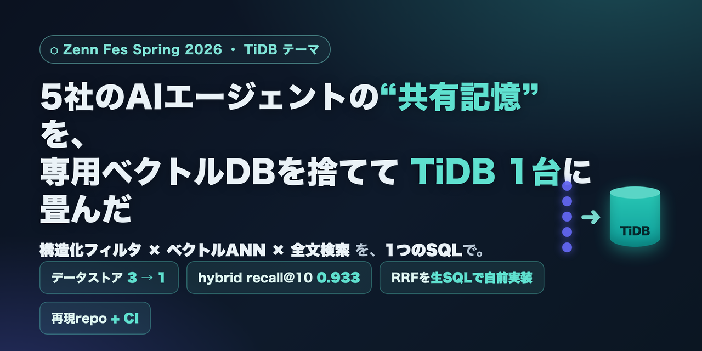

# tidb-agent-memory



> GitHub の Settings → Options → Social preview に `article/assets/ogp.png` を設定すると、
> 共有時のOGPカードになります（X/note等の宣伝にも流用可）。

5社のAIエージェント(Claude / Gemini / Codex / Grok + orchestrator)が共有する**長期記憶**を、
専用ベクトルDB＋全文エンジン＋RDB の3層構成から **TiDB Cloud 1台** に畳んだ最小再現リポジトリ。
**構造化フィルタ × ベクトルANN × 全文検索 を 1 つの SQL** で実行する。

> Zenn Fes Spring 2026 / TiDBテーマ「AIでの情報検索(RAG等)やAIエージェントのメモリ機能」応募作。

## ⚠️ 最初に: クラスタは Singapore で作ること
TiDBの全文検索(`fts_match_word`)は **TiDB Cloud Starter かつ AWS `ap-southeast-1`(Singapore) または `eu-central-1`(Frankfurt)** のみ。
**US等で作ると全文検索が使えず詰む。** → `ap-southeast-1` を選択。
(出典: pingcap/docs vector-search-full-text-search-sql)

## 必要なもの
- Python 3.10+
- TiDB Cloud Starter クラスタ(無料枠, **Singaporeリージョン**)の接続情報
- 埋め込みは既定で**ローカルモデル(APIキー不要)**。OpenAIを使う場合のみ APIキー。

## クイックスタート (目標 10分)
```bash
cp .env.example .env        # TIDB_DSN を記入 (EMBED_BACKEND=local のままでOK)
make setup                  # venv + 依存 + ローカル埋め込みモデルDL
make seed                   # 合成メモリ ~400件 + 評価用クエリ40件を生成
make schema                 # schema/01_schema.sql を適用 (VECTOR + FULLTEXT)
make ingest                 # 埋め込み生成 → TiDB へ投入
make bench                  # before(3層) vs after(TiDB) を実測 → bench/results/results.md
```

## これは何を示すか
- `schema/01_schema.sql` … `VECTOR(384)` + `FULLTEXT ... WITH PARSER MULTILINGUAL` の1テーブル。
- `schema/02_hybrid_recall.sql` … 構造化WHERE×ベクトルANN×全文を **RRF(自前実装)** で融合した想起SQL。
  公式のhybrid searchガイドは pytidb の `.fusion()` のみ案内で生SQLのRRF例が見当たらないため、`ROW_NUMBER()+1/(k+rank)` で実装。
- `bench/` … recall@5/@10・MRR・レイテンシを4モード(vector/fts/hybrid/旧3層baseline)で比較。

## 正直に
- seedデータは**合成**(本番KBの構造=signal_type分類を模したもの)。本番の未公開数値は載せていない。
- **全文検索**は公式が **"early stages(限定提供)"** と明記。**ベクトル検索**は対象リージョンで利用可
  (現行docs上は明示的なbeta表記なし)。本番採用は最新docsで状態を要確認。
- 記事中の数値はすべて本repoの`make bench`で再現できる。

## ライセンス
MIT (予定)
