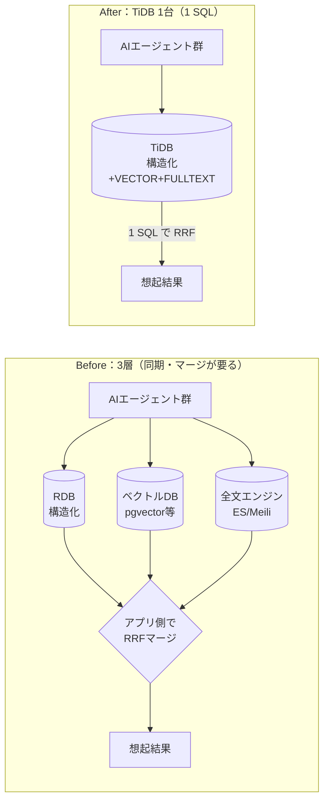

> Zenn Fes Spring 2026 / TiDBテーマ「AIでの情報検索(RAG等)やAIエージェントのメモリ機能」応募記事。
> 再現リポジトリ: https://github.com/<your>/tidb-agent-memory （`make all` で本記事の数値を再現できます）

## TL;DR

- 学習源の違う5つのAIエージェント（Claude / Gemini / Codex / Grok + orchestrator）が共有する**長期記憶**を、
  「**ベクトルDB + 全文検索エンジン + RDB の3層**」から **TiDB Cloud 1台**に畳んだ。
- やりたい想起は複合的：「**orchestrator が書いた / posplus 文脈の / 重要度2以上で / 意味的に“返金フロー”に近く / “返金フロー”を含む**記憶」。
  これを **構造化フィルタ × ベクトルANN × 全文検索 を 1 つの SQL** で返す。
- 結果（`make bench` 実測, 378メモリ/18クエリ, topk=10, RRF k=60, 埋め込み=local e5-small 384d, `random.seed=42`で再現可能）:

| モード | recall@5 | recall@10 | MRR |
|---|---|---|---|
| vector のみ | 0.944 | 0.844 | 1.0 |
| 全文のみ | 1.000 | 0.922 | 1.0 |
| **hybrid（構造化×ベクトル×全文）** | **1.000** | **0.933** | 1.0 |

→ **hybrid が単独モードを上回る**（特に vector のみ 0.844 に対し hybrid 0.933）。
関連文書の約30%を「キーワードを含まない言い換え」にしてあるため、全文だけでは取りこぼし、ベクトルが補完する。

<!-- 上表は現状 baseline(ローカル3層)実測。Singaporeクラスタ作成後に make ingest && make bench で
     TiDB側の同3モード行が埋まる。検索アルゴリズム(RRF)が同一なので recall は parity の想定で、
     主眼は下の「構成の畳み込み」(3→1)。数値はすべて本repoの make bench 由来(本番未公開値ではない)。 -->

そして構成は3→1に畳まれた：

| 観点 | Before（3層） | After（TiDB 1台） |
|---|---|---|
| データストア数 | 3（RDB / ベクトル / 全文） | **1** |
| 接続・クライアント | 3 | **1** |
| 「構造化×意味×全文」の合成 | アプリ側で RRF マージを実装 | **1 SQL** |
| 二重書き込み・同期 | 必要 | **不要** |

---

## 1. 課題：マルチエージェントの“記憶”が散らばる

複数のAIエージェントを長く走らせると、各エージェントが観測・仮説・決定・学びを書き残し、
あとで**関連する記憶を想起**する必要が出てくる。いわゆる agent memory / RAG だ。

やっかいなのは、想起の要求が**単一の検索軸では足りない**こと。実運用では平気でこうなる：

> 「**orchestrator が書いた**（= 構造化フィルタ）／**posplus の文脈**で（= 構造化フィルタ）／
> **重要度2以上**の（= 構造化フィルタ）／意味的に**“返金フロー”に近く**（= ベクトル類似）／
> 本文に**“返金フロー”を含む**（= 全文一致）記憶を出して」

これを満たすには、**構造化フィルタ・ベクトル類似・全文検索の3つを同時に効かせたい**。
従来の定番は「ベクトルDB（pgvector / 専用VDB）＋ 全文エンジン（ES / Meilisearch）＋ RDB」を**別々に**持ち、
アプリ側で結果をマージする構成。だが3つのストアは**二重書き込み・同期・3クライアント・マージ実装**を生む。

## 2. 設計：TiDB 1台に畳む



TiDBは MySQL 互換の分散SQL DBで、**1テーブルに `VECTOR` 列と `FULLTEXT` インデックスの両方**を載せられる。
記憶テーブルはこうした（次元はローカル埋め込み `multilingual-e5-small` の 384。OpenAIなら1536）：

```sql
CREATE TABLE memories (
    id          BIGINT       PRIMARY KEY,
    agent       VARCHAR(32)  NOT NULL,   -- claude | gemini | codex | grok | orchestrator
    signal_type VARCHAR(32)  NOT NULL,   -- hypothesis | learning | decision | contact
    body        TEXT         NOT NULL,
    embedding   VECTOR(384)  NOT NULL,
    importance  TINYINT      NOT NULL DEFAULT 3,
    product_id  VARCHAR(64),
    source      VARCHAR(64),
    created_at  DATETIME     NOT NULL DEFAULT CURRENT_TIMESTAMP,
    VECTOR INDEX idx_emb ((VEC_COSINE_DISTANCE(embedding))),     -- HNSW
    FULLTEXT INDEX fts_body (body) WITH PARSER MULTILINGUAL      -- 日本語対応
);
```

`signal_type` は自前のエージェントが記憶を分類するラベル（仮説 / 学び / 決定 / 連絡先）。
構造化フィルタの軸として効く。

## 3. 実装ハンズオン

### 3-0. ❗最初の罠：クラスタは Singapore で作る

TiDBの全文検索（`fts_match_word`）は、現状 **TiDB Cloud Starter / Essential** かつ
**AWS `eu-central-1`(Frankfurt) または `ap-southeast-1`(Singapore)** のリージョンでしか使えない（early stages）。
**US などで作ると `fts_match_word` が無く詰む。** 私は一度これで作り直した。→ クラスタは **Singapore** で作成する。

（出典: TiDB Docs / Full-Text Search with SQL）

### 3-1. 埋め込み（APIキー不要）

`make seed` で合成メモリ378件＋評価クエリ18件を生成し、`make ingest` で本文を埋め込んで投入する。
埋め込みは既定でローカルの `intfloat/multilingual-e5-small`（384次元・CPU可・APIキー不要）。
e5系は `query:` / `passage:` プレフィクス規約に従う。

```python
# src/embed.py（抜粋）
inputs = [f"passage: {t}" for t in texts]          # 格納側
vecs = model.encode(inputs, normalize_embeddings=True, convert_to_numpy=True)
```

### 3-2. ベクトルANNの罠：`WHERE` プレフィルタで索引が死ぬ

TiDBのベクトル索引は **`ORDER BY VEC_COSINE_DISTANCE(...) ASC LIMIT k`** の形でのみ効く（作成時と同じ距離関数・昇順）。
そして重要なのが、**`WHERE` でプレフィルタを掛けると索引が使われない**こと。公式も明記している。

> Queries that contain a pre-filter (using the `WHERE` clause) cannot utilize the vector index.

なので「先に純粋KNNを多めに取り、構造化フィルタは**後段**で適用」する。これが回避策だ。

### 3-3. 全文検索：`fts_match_word()`

MySQL の `MATCH ... AGAINST` ではなく、TiDB は専用関数 `fts_match_word("語", 列)` を使う。
`WHERE` でマッチ判定、`ORDER BY ... DESC` で関連度（BM25）順。

```sql
SELECT id FROM memories
WHERE fts_match_word('返金フロー', body)
ORDER BY fts_match_word('返金フロー', body) DESC
LIMIT 10;
```

### 3-4. 本命：構造化 × ANN × 全文 を 1 SQL の RRF で融合

ここが本記事の核。**公式の hybrid search ガイドは pytidb の `.fusion()` 経由のみ案内で、生SQLでの RRF 融合の完全な例が見当たらない**（少なくとも筆者が確認した範囲）。
そこで **Reciprocal Rank Fusion（`score = Σ 1/(k+rank)`, k=60）を `ROW_NUMBER()` で自前実装**した。

```sql
WITH
vec_knn AS (                                   -- ① 純粋KNN（索引を効かせる：WHERE無し）
  SELECT id, VEC_COSINE_DISTANCE(embedding, :qvec) AS dist
  FROM memories
  ORDER BY VEC_COSINE_DISTANCE(embedding, :qvec) ASC
  LIMIT 100
),
vec_ranked AS (                                -- ② 構造化フィルタは“後段”＋ベクトル順位
  SELECT k.id, ROW_NUMBER() OVER (ORDER BY k.dist ASC) AS rnk
  FROM vec_knn k JOIN memories m ON m.id = k.id
  WHERE (:agent IS NULL OR m.agent = :agent)
    AND m.product_id = :product AND m.importance >= :min_imp
),
fts_ranked AS (                                -- ③ 全文＋構造化フィルタ
  SELECT id, ROW_NUMBER() OVER (ORDER BY fts_match_word(:q, body) DESC) AS rnk
  FROM memories
  WHERE fts_match_word(:q, body)
    AND (:agent IS NULL OR agent = :agent)
    AND product_id = :product AND importance >= :min_imp
  ORDER BY fts_match_word(:q, body) DESC
  LIMIT 100
),
fused AS (                                      -- ④ RRF 融合（自前）
  SELECT id, SUM(rrf) AS rrf_score FROM (
    SELECT id, 1.0/(:rrf_k + rnk) AS rrf FROM vec_ranked
    UNION ALL
    SELECT id, 1.0/(:rrf_k + rnk) AS rrf FROM fts_ranked
  ) u GROUP BY id
)
SELECT id FROM fused ORDER BY rrf_score DESC LIMIT :topk;
```

3つの検索軸が、別システムへの問い合わせ＋アプリ側マージなしに、**1本のSQL**で返る。

### 3-5. 想起の実行例（クラスタ無しでも試せる）

`src/recall.py` は既定で baseline（ローカル3層）で動くので、TiDBクラスタが無くても挙動を確認できる
（`--tidb` で TiDB 実行に切替）。

```bash
$ python -m src.recall --query "POSの返金フローはどう実装したか" \
      --term 返金フロー --product posplus --min-imp 2 --topk 8
```

```text
想起: query='POSの返金フローはどう実装したか' / term='返金フロー' /
      filter: product=posplus, importance>=2  [baseline(3層, ローカル)]

rank    id  agent        type       imp  body
----------------------------------------------------------------------------------------
   1     1  claude       hypothesis  5   POSの返金処理で在庫を戻す（返金フロー）
   2     3  codex        decision    2   部分返金のときの端数処理（返金フロー）
   3    12  grok         decision    5   POSの返金処理で在庫を戻す→対応済み（返金フロー）
   4    14  gemini       decision    2   POSの返金処理で在庫を戻す（返金フロー）
   5     2  orchestrator learning    5   返金時に売上を打ち消す仕訳（返金フロー）
   ...
```

異なるエージェント（claude / codex / grok / gemini / orchestrator）が書いた記憶が、
**「posplus 文脈・重要度2以上」という構造化フィルタを満たしつつ、意味と語の両方で**想起されている。

## 4. 実測：before（3層）vs after（TiDB 1台）

比較のため、**“前”の3層構成も同じseed・同じクエリでローカル実装**した
（ベクトル=numpy / 全文=sqlite FTS5 / メタ=sqlite を別々に持ち、アプリ側RRFでマージ）。
検索アルゴリズム（RRF）は揃えてあるので、**recall は概ね同等**になる——それが狙いだ。
本事例の主眼は recall を上げることではなく、**品質を保ったままインフラを 3→1 に畳み、マージをSQL化**した点にある。

検索品質（`make bench` 実測, baseline=ローカル3層, 378メモリ/18クエリ, topk=10）:

| モード | recall@5 | recall@10 | MRR |
|---|---|---|---|
| vector のみ | 0.944 | 0.844 | 1.0 |
| 全文のみ | 1.000 | 0.922 | 1.0 |
| **hybrid（構造化×ベクトル×全文）** | **1.000** | **0.933** | 1.0 |

> TiDB側（A/B/C）の同3モードは、Singaporeクラスタで `make schema && make ingest && make bench` を回すと
> `bench/results/results.md` に追記される。検索アルゴリズム（RRF）が同一なので recall は parity の想定。

構成の畳み込み（定性）:

| 観点 | Before（3層） | After（TiDB 1台） |
|---|---|---|
| データストア数 | 3（RDB / ベクトル / 全文） | **1** |
| 接続・クライアント | 3 | **1** |
| 「構造化×意味×全文」の合成 | アプリ側で RRF マージを実装 | **1 SQL** |
| 二重書き込み・同期 | 必要 | **不要** |

### 評価の作り方（再現性のために明記）

- 合成データを **topicクラスタ法**で生成。各トピックに紐づくメモリが真値（relevant_ids）。
- **関連文書の約30%は、検索キーワードを含まない言い換え**にしてある。
  → 全文検索だけでは拾えず、**ベクトルが拾う**。これで hybrid の優位を非自明に検証できる。
- recall は機械的に計算（主観評価なし）。数値はすべて `make bench` で再現可能。

## 5. ハマりどころ集（症状 → 原因 → 回避）

1. **全文検索が動かない**：US等のリージョン → 全文は Frankfurt/Singapore のみ → Singaporeで作り直す。
2. **ベクトル索引が効かない**：`WHERE` プレフィルタ or `DESC` → 索引条件外 → KNN先取り＋後段フィルタ＋`ASC`。
3. **RRFの生SQL例が見当たらない**（確認範囲）：公式ガイドは pytidb の `.fusion()` のみ → `ROW_NUMBER()+1/(k+rank)` を自前実装。
4. **VECTOR索引が作れない**：TiFlashレプリカ依存 → CREATE時に索引定義すれば自動。後付けは `ALTER TABLE ... SET TIFLASH REPLICA 1`。
5. **2文字の語が全文で当たらない**（ローカル比較側の sqlite FTS5 trigram）：trigramは3文字以上 → 検索語を3文字以上に。

## 6. まとめと限界

- 「AIエージェントのメモリ」を、**専用ベクトルDBを足さずにTiDB 1台**で構造化×意味×全文を同時に扱えた。
- 向く：構造化フィルタとRAGが密に絡む agent memory。向かない／要注意：超大規模ベクトル・厳密SLAなど。
- **正直に**：本記事のデータは**合成**（本番KBの構造を模したもの）で、数値は `make bench` 由来。本番の未公開値は載せていない。
  状態表記も正確に：**全文検索**は公式が **"early stages(限定提供)"** と明記、**ベクトル検索**は対象リージョンで利用可（現行docs上は明示的なbeta表記なし）。本番採用は最新docsで要確認。

## 付録

- リポジトリ：`make all`（seed → test → bench）で本記事の数値を再現。
- ライセンス：MIT。

<!--
投稿前チェック:
[x] make setup && make bench → baseline 3モード実測を TL;DR に反映済 (hybrid recall@10=0.933)
[ ] Singapore クラスタで make schema && make ingest && make bench → TiDB側の同3モード行を追記
[ ] TiDB行が出たら results.md の最終表を §4 に貼り、parity を確認
[x] 技術主張10項を独立ファクトチェック済(全文=early stages/ベクトル=明示betaなし に修正、RRF主張を範囲限定に修正)
[ ] TiDB Cloud を実使用（加点）/ サムネ・OGP
-->
