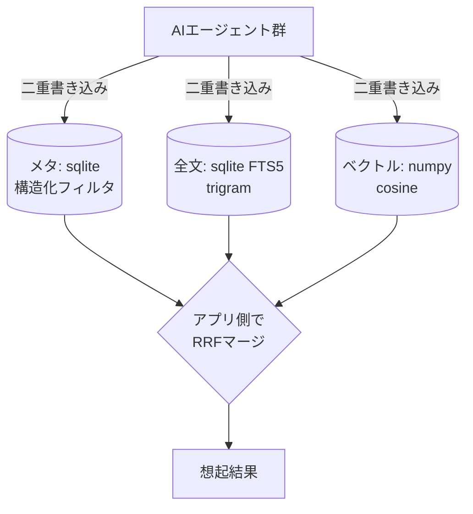

# before/ — “前”の3層構成（比較対象）

`baseline.py` は、TiDBに畳む**前**の「業界標準のRAG構成」をローカル最小実装したもの。
TiDB（1台/1 SQL）との apples-to-apples 比較のために、**検索アルゴリズム（RRF融合）は本番と同一**にしてある。

## なぜこの構成が「重い」のか
- **データストアが3つ**（メタ／全文／ベクトル）→ 接続・運用・監視が3系統。
- **二重書き込み**：1件の記憶を3つのストアに整合的に書き込む必要がある。
- **マージをアプリ側で実装**：構造化フィルタ × ベクトル類似 × 全文 を、各ストアから取り寄せて
  アプリのコードで RRF 融合する（= `BaselineStore.hybrid_rrf`）。

これらが TiDB では **1テーブル・1 SQL** に畳まれる（リポジトリ直下 `schema/02_hybrid_recall.sql`）。

## 正直な注記
- ここでの「専用ベクトルDB / 全文エンジン」は、Pinecone や Elasticsearch 等を**ローカルの代役**
  （numpy / sqlite FTS5）で最小再現したもの。**特定製品を本番で使っていたという主張ではない**。
- 目的は「3層を別々に持つと何が増えるか」を**同一seed・同一クエリで実測比較**できるようにすること。
  recall は同一アルゴリズムなので TiDB とほぼ同等になる（=品質を保ったままインフラを畳めることの確認）。
